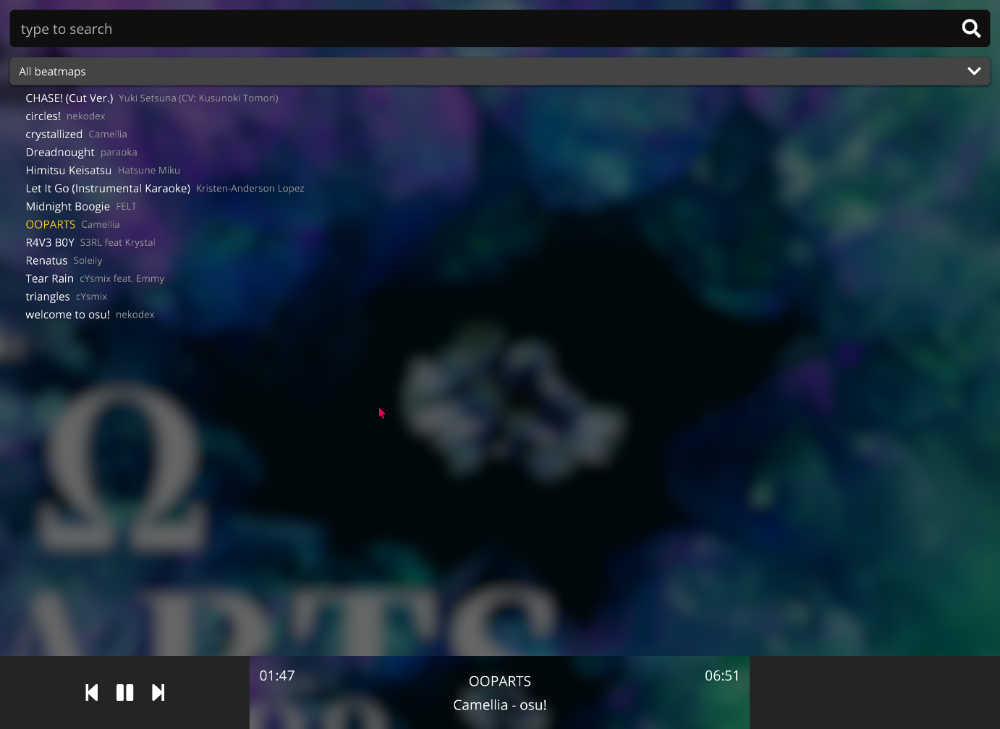

# LazerPlayer

A music player for osu!lazer beatmaps.

  

## Notes

Currently this program pretends to be osu!lazer to get access to the database.

## Licence

LazerPlayer's code is licensed under the [MIT licence](https://opensource.org/licenses/MIT). Please see [the licence file](LICENCE) for more information. [tl;dr](https://tldrlegal.com/license/mit-license) you can do whatever you want as long as you include the original copyright and license notice in any copy of the software/source.

Please also note that game resources are covered by a separate licence. Please see the [ppy/osu-resources](https://github.com/ppy/osu-resources) repository for clarifications. The goal is to eventually remove osu-resources as a dependency for this project. Due to the usage of some elements in osu!lazer this is currently required. 